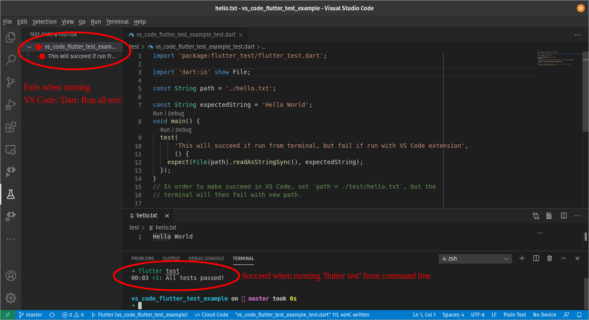

### Example to reproduce an inconsitency between VS Code Dart (Flutter) Extension and Flutter from command line.

### Steps to reproduce:
Prereqs:
 * Have Flutter SDK installed and in path
 * Have VS Code installed with Dart and Flutter extensions

Steps:
1. Clone repo
2. cd into project root (vs_code_flutter_test_example)
3. from terminal, run `flutter test`
    * the single test should **succeed** 🟢
4. from VS Code, bring up Command Palette (Ctrl+Shift+P on linux)
5. Type and Select `Dart: Run all tests`
    * the single test should **fail** 🔴

Conclusion:
    ❗ **Tests should not be succeeding from terminal, but failing from extension. This is inconsistent** ❗

Reason:
The reason for the difference is the use of the dart.io class `File` when used with a relative path. 

When running `flutter test` from the command line, all tests are run relative to the `test` directory.  In contrast, the VS code is evaluates paths relative to the projects root directory.

In the example a `hello.txt` document exists in the `test` directory. 

So Flutter is looking for `hello.txt`, but the extension expects `test/hello.txt`

Please take note of the screenshot below. You will notice that the tests have failed in the VS Code test (on upper right side); however, they have succeeded when run from the terminal.

